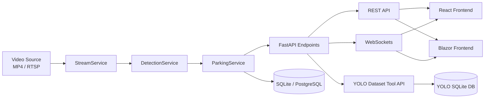
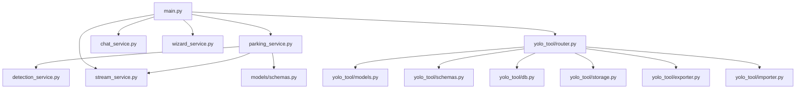
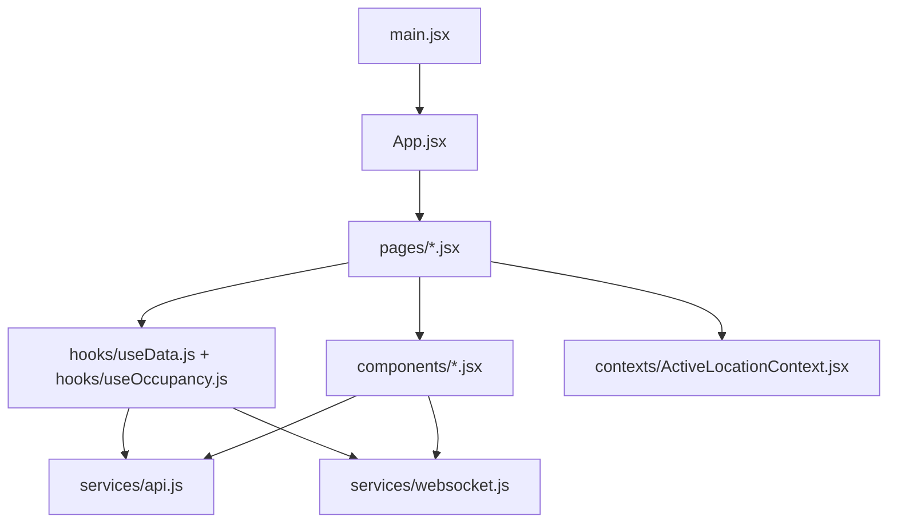
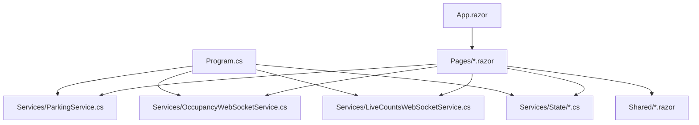

# Smart Parking POC - Code Documentation

This repository contains a real-time parking analytics platform with:

- FastAPI backend for detection, occupancy, chat, and location workflows.
- React (Vite) frontend for modern SPA-based operations and developer setup.
- Blazor Server frontend for a .NET dashboard experience.
- YOLO/RF-DETR training and dataset tooling.

## 1. High-Level Architecture



## 2. Top-Level Files and Folders

| Path | What It Does |
|---|---|
| `docker-compose.yml` | Defines multi-service setup for backend, React frontend, and optional training container. |
| `global.json` | Pins .NET SDK behavior for the Blazor project. |
| `process_yolo_video.py` | Standalone helper script for YOLO video processing workflows. |
| `test_infrence_speed.py` | Local script for model inference speed benchmarking. |
| `yolo_trained.pt` | Trained YOLO weights used by entry/exit or custom detection flows. |
| `backend/` | FastAPI backend source, service layer, and YOLO dataset tool APIs. |
| `frontend/` | React + Vite SPA implementation. |
| `blazor-frontend/` | .NET 8 Blazor Server dashboard implementation. |
| `training/` | Training datasets and scripts for RF-DETR and YOLO model workflows. |
| `data/`, `entry/`, `exit/` | Runtime artifacts, videos, and image outputs for detection pipelines. |

## 3. Backend Documentation

### 3.1 Backend Core Files (`backend/app`)

| File | Role |
|---|---|
| `backend/app/main.py` | FastAPI app entrypoint: initializes services, registers routers, defines REST/WebSocket endpoints, and lifecycle startup/shutdown logic. |
| `backend/app/run_job.py` | Batch processing orchestrator that runs detection jobs over one or more input videos. |
| `backend/app/video_process_count.py` | Video counting engine for offline processing; applies model inference per frame and aggregates counts by region. |
| `backend/app/yolotracker_entry_exit.py` | Entry/exit stream tracker using YOLO + tracking logic to count vehicles crossing configured zones. |
| `backend/app/test.py` | Local test/playground script artifact for backend experimentation. |
| `backend/app/__init__.py` | Package marker for backend app module imports. |

### 3.2 Backend Models (`backend/app/models`)

| File | Role |
|---|---|
| `backend/app/models/schemas.py` | Pydantic request/response schemas for occupancy, forecast, chat, grid configuration, and publish-location APIs. |
| `backend/app/models/__init__.py` | Package marker for model imports. |

### 3.3 Backend Services (`backend/app/services`)

| File | Role |
|---|---|
| `backend/app/services/detection_service.py` | Detection abstraction layer that loads RF-DETR or YOLO, runs segmented inference, and filters detections. |
| `backend/app/services/parking_service.py` | Core business orchestration: capture frame -> detect vehicles -> map zones -> compute occupancy -> persist history. |
| `backend/app/services/stream_service.py` | Video source manager for frame capture, looping playback, and JPEG frame exposure for frontend endpoints. |
| `backend/app/services/chat_service.py` | GPT/pydantic-ai integration that generates parking assistant responses from live context data. |
| `backend/app/services/wizard_service.py` | Isolated developer wizard inference workflow used for testing models/parameters without disrupting live pipeline. |
| `backend/app/services/__init__.py` | Package marker for service imports. |

### 3.4 YOLO Dataset Tool (`backend/app/yolo_tool`)

| File | Role |
|---|---|
| `backend/app/yolo_tool/router.py` | FastAPI router for dataset project CRUD, image/annotation endpoints, and import/export operations. |
| `backend/app/yolo_tool/models.py` | SQLAlchemy ORM models for YOLO projects, classes, images, groups, and annotations. |
| `backend/app/yolo_tool/schemas.py` | Pydantic schemas for YOLO tool API requests and responses. |
| `backend/app/yolo_tool/db.py` | SQLAlchemy engine/session setup and DB initialization helpers. |
| `backend/app/yolo_tool/storage.py` | File upload and persistence helpers for image assets. |
| `backend/app/yolo_tool/exporter.py` | Dataset exporter utilities for packaging annotations/assets. |
| `backend/app/yolo_tool/importer.py` | Dataset importer utilities for loading external YOLO-formatted data. |
| `backend/app/yolo_tool/__init__.py` | Package exports and YOLO tool initialization entrypoints. |

### 3.5 Backend Dependency Flow



## 4. React Frontend Documentation (`frontend/src`)

### 4.1 Entry and Routing

| File | Role |
|---|---|
| `frontend/src/main.jsx` | React app bootstrap and root render. |
| `frontend/src/App.jsx` | Route map and top-level page composition. |

### 4.2 Pages

| File | Role |
|---|---|
| `frontend/src/pages/LandingPage.jsx` | Landing experience and entry point for user journeys. |
| `frontend/src/pages/PersonaSelection.jsx` | Persona selection flow for role-based navigation. |
| `frontend/src/pages/UserLocations.jsx` | Location selection and activation UI. |
| `frontend/src/pages/DeveloperSetup.jsx` | Developer wizard for setup/model workflows and calibration tasks. |
| `frontend/src/pages/Dashboard.jsx` | Main operational dashboard combining live occupancy, charts, feeds, and assistant interactions. |
| `frontend/src/pages/DataFlow.jsx` | Visual explanation page for how data moves through the system. |

### 4.3 Components

| File | Role |
|---|---|
| `frontend/src/components/AppIcon.jsx` | Reusable app/brand icon component. |
| `frontend/src/components/AuroraBackground.jsx` | Animated/styled background wrapper component. |
| `frontend/src/components/Card3D.jsx` | Stylized 3D-effect card wrapper for UI tiles. |
| `frontend/src/components/Charts.jsx` | Chart rendering helpers for occupancy/statistics panels. |
| `frontend/src/components/ChatPanel.jsx` | Chat assistant UI and message interaction surface. |
| `frontend/src/components/DashboardView.jsx` | Dashboard visualization section with key occupancy widgets/charts. |
| `frontend/src/components/FloatingChat.jsx` | Floating chat launcher/overlay integration. |
| `frontend/src/components/GalaxyCanvas.jsx` | Canvas-driven visual effect component used in themed pages. |
| `frontend/src/components/Globe.jsx` | Globe visualization component for location/thematic display. |
| `frontend/src/components/Header.jsx` | Main app header and navigation actions. |
| `frontend/src/components/LiveFeed.jsx` | Live feed container for streaming/preview panels. |
| `frontend/src/components/LocationInfo.jsx` | Displays location metadata and contextual status details. |
| `frontend/src/components/MapView.jsx` | Map-centric layout for selected parking location visualization. |
| `frontend/src/components/OccupancyGauge.jsx` | Gauge component for occupancy percentage visualization. |
| `frontend/src/components/ParkingMap.jsx` | Parking lot map/zone rendering component. |
| `frontend/src/components/StatCards.jsx` | KPI cards for totals, occupancy, availability, and derived stats. |
| `frontend/src/components/ThemeToggle.jsx` | UI theme switcher for light/dark or style variants. |
| `frontend/src/components/VideoFeed.jsx` | Video rendering component for backend stream frame display. |
| `frontend/src/components/YoloDatasetTool.jsx` | Frontend interface for YOLO dataset management workflows. |

### 4.4 Hooks, Context, Services, Styles

| File | Role |
|---|---|
| `frontend/src/hooks/useData.js` | Reusable data hooks for history/forecast/stats retrieval and refresh. |
| `frontend/src/hooks/useOccupancy.js` | Live occupancy hook that integrates WebSocket updates and state handling. |
| `frontend/src/contexts/ActiveLocationContext.jsx` | Shared state provider for currently active parking location. |
| `frontend/src/services/api.js` | REST API client wrapper for backend endpoints. |
| `frontend/src/services/websocket.js` | WebSocket connection manager for real-time occupancy and status updates. |
| `frontend/src/styles/index.css` | Global styles and base design tokens for the React app. |

### 4.5 React Dependency Flow



## 5. Blazor Frontend Documentation

### 5.1 App Bootstrap and Config

| File | Role |
|---|---|
| `blazor-frontend/Program.cs` | Blazor Server startup, DI container/service registration, HTTP pipeline setup. |
| `blazor-frontend/App.razor` | Top-level router and layout selection for Razor components. |
| `blazor-frontend/_Imports.razor` | Global namespace imports for Razor files. |
| `blazor-frontend/appsettings.json` | Runtime settings (backend URL, camera feeds, model paths, app URLs). |
| `blazor-frontend/Pages/_Host.cshtml` | Server-side host page for Blazor app bootstrapping. |
| `blazor-frontend/Pages/_Layout.cshtml` | Shared HTML layout shell for hosted pages. |

### 5.2 Models and Services

| File | Role |
|---|---|
| `blazor-frontend/Models/ParkingModels.cs` | C# DTOs for occupancy, history, chat, and supporting API payloads. |
| `blazor-frontend/Services/ParkingService.cs` | HTTP client service for backend REST operations. |
| `blazor-frontend/Services/OccupancyWebSocketService.cs` | Real-time occupancy WebSocket service with reconnect handling. |
| `blazor-frontend/Services/LiveCountsWebSocketService.cs` | Real-time entry/exit count WebSocket service. |
| `blazor-frontend/Services/State/CarDetection.cs` | Scoped state model for detected vehicle/event tracking state. |
| `blazor-frontend/Services/State/ConfigurationState.cs` | Scoped state store for lot configuration values and updates. |
| `blazor-frontend/Services/State/EntryExitState.cs` | Scoped state container for entry/exit counters and related values. |
| `blazor-frontend/Services/State/GarageSelectionState.cs` | Scoped state for selected garage/location context. |

### 5.3 Pages and Shared Components

| File | Role |
|---|---|
| `blazor-frontend/Pages/Configuration.razor` | Configuration UI for lot capacities and operational settings. |
| `blazor-frontend/Pages/Dashboard.razor` | Main dashboard page for occupancy KPIs and real-time status. |
| `blazor-frontend/Pages/DetectionEvidence.razor` | Displays detection outputs/evidence views for validation workflows. |
| `blazor-frontend/Pages/EntryExit.razor` | Entry/exit monitoring page with live counters and status widgets. |
| `blazor-frontend/Pages/LiveCounts.razor` | Live count view focused on streaming count telemetry. |
| `blazor-frontend/Shared/MainLayout.razor` | Root layout wrapper containing nav and content region. |
| `blazor-frontend/Shared/NavMenu.razor` | Left/top navigation component linking pages. |
| `blazor-frontend/Shared/RecentActivity.razor` | Recent activity panel component. |
| `blazor-frontend/Shared/ReserveParking.razor` | Parking reservation UI component. |
| `blazor-frontend/Shared/UpdateLotCount.razor` | Shared control component for lot count updates. |

### 5.4 Blazor Dependency Flow



## 6. Runtime Dependency Reference

### 6.1 Backend (`backend/requirements.txt`)

- API/server: `fastapi`, `uvicorn`, `websockets`, `python-multipart`
- Validation/config: `pydantic`, `pydantic-settings`, `python-dotenv`
- Detection/AI: `ultralytics`, `rfdetr`, `sahi`, `openai`, `pydantic-ai`
- CV/data: `opencv-python-headless`, `Pillow`, `numpy`, `scipy`, `pandas`, `scikit-learn`
- DB and storage: `SQLAlchemy`, `aiosqlite`, `psycopg2-binary`, `aiofiles`
- Utility: `httpx`, `openpyxl`, `python-json-logger`, `imageio-ffmpeg`

### 6.2 React (`frontend/package.json`)

- Core: `react`, `react-dom`, `react-router-dom`
- Visualization and UX: `chart.js`, `react-chartjs-2`, `leaflet`, `framer-motion`, `cobe`
- Build tooling: `vite`, `@vitejs/plugin-react`

### 6.3 Blazor (`blazor-frontend/BlazorParking.csproj`)

- Framework: .NET 8 (`Microsoft.NET.Sdk.Web`)
- No explicit extra NuGet packages listed; uses ASP.NET Core/Blazor framework-provided packages.

## 7. Run Instructions (Local)

### 7.1 Backend

```bash
cd backend
pip install -r requirements.txt
uvicorn app.main:app --host 127.0.0.1 --port 8000
```

Health check: `http://127.0.0.1:8000/api/v1/health`

### 7.2 Blazor Frontend

```bash
cd blazor-frontend
dotnet run
```

Default UI URL (configured): `http://localhost:5002`

### 7.3 React Frontend

```bash
cd frontend
npm install
npm run dev
```

## 8. Notes and Non-Source Artifacts

- `bin/`, `obj/`, and `.ipynb_checkpoints/` directories contain build/checkpoint artifacts and are not core source.
- Model weights (`*.pt`) are large runtime assets and should be versioned/managed carefully for deployment.
- Docker compose includes an optional `train` profile for model fine-tuning workflows.
