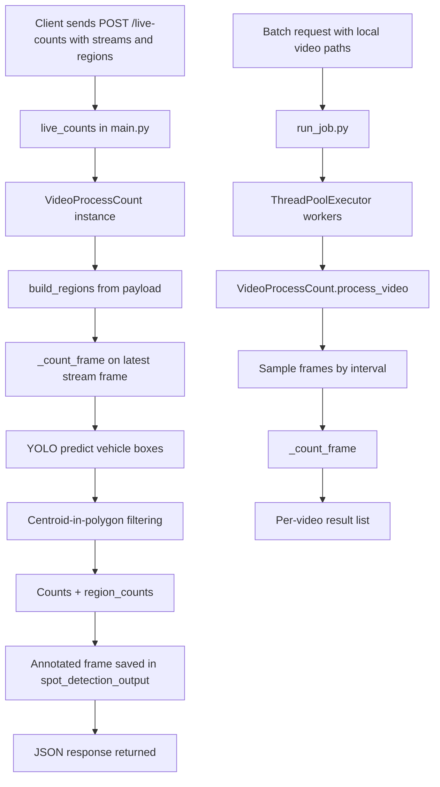

# Code Explanation: spot_detection, video_process_count, run_job

This document explains how the three main pieces fit together:

- spot_detection logic (implemented in the `/live-counts` endpoint)
- `video_process_count.py`
- `run_job.py`

## 1) What "spot_detection" means in this codebase

There is no standalone `spot_detection.py` file.
In this project, "spot detection" is handled by the live counting endpoint in `backend/app/main.py`:

- Route: `POST /live-counts`
- Function: `live_counts(request: Request)`
- Output images are saved under a folder named `spot_detection_output`

At a high level, this endpoint:

1. Accepts a list of camera streams.
2. Opens each stream, reads one frame.
3. Builds polygon regions from request payload.
4. Runs vehicle detection on that frame.
5. Returns per-stream counts and region counts.
6. Saves an annotated frame image per stream.

## 2) `video_process_count.py` responsibilities

`video_process_count.py` contains the core detection and counting logic.

### Key constants and caches

- `VEHICLE_CLASSES = {2: "car", 5: "bus", 7: "truck"}`
- `_MODEL_CACHE`: shares loaded YOLO models by path.
- `_MODEL_LOCK`: thread-safe model loading.
- `_INFER_LOCK`: serializes inference calls to avoid thread issues.

### Helper functions

1. `clamp_points(points, width, height)`
- Clamps polygon points to frame boundaries.
- Prevents invalid region coordinates.

2. `build_regions(regions, width, height)`
- Converts payload region definitions into an internal list format:
  - region name
  - clamped polygon points
  - display color

### Class: `VideoProcessCount`

Main methods:

1. `_get_model()`
- Loads YOLO model once per model path and reuses it from cache.

2. `_read_frame_at_second(cap, fps, sec)`
- Seeks around a target timestamp (`sec`, `sec-0.2`, `sec-0.5`, `sec-1.0`) to recover a decodable frame.

3. `_count_frame(frame, regions, output_dir=None, cam_id=None)`
- Runs YOLO prediction for configured vehicle classes.
- For each box, uses centroid `(cx, cy)`.
- If regions exist:
  - counts only detections whose centroid is inside a region.
  - increments both total count and per-region count.
- If no regions exist:
  - counts all vehicle detections.
- Builds visual metadata (`box`, `label`, `color`).
- Saves an annotated frame and returns:
  - `total_count`
  - `region_counts`
  - `detections`
  - `frame_path`

4. `_save_annotated_frame(...)`
- Draws semi-transparent regions, boxes, labels, and summary text.
- Saves to: `<output_dir>/<cam_id>/second_<timestamp>.jpg`

5. `process_video(video_path, interval_seconds, regions, save_annotated_frames, save_output_dir)`
- File-based sampling workflow (not live stream):
  - opens a local video
  - samples frame(s) by interval
  - counts vehicles on sampled frames
  - optionally writes debug images
- Returns either:
  - single `count` (short video case), or
  - `counts` list for each sampled second

## 3) `run_job.py` responsibilities

`run_job.py` provides batch orchestration for local video files.

Function: `run_job(...)`

- Creates one `VideoProcessCount` instance.
- Executes `process_video(...)` concurrently over input video paths with `ThreadPoolExecutor`.
- Preserves result ordering by storing output at original index.
- Returns batch metadata:
  - total input count
  - model and threshold settings
  - per-video results

This is useful for offline processing where multiple videos are analyzed in parallel.

## 4) End-to-end flow relationship

## 5) Practical difference between live_counts and run_job

- `live_counts`:
  - Input: live stream sources (RTSP/URL/device source)
  - Reads a current frame per stream
  - Good for near-real-time parking spot occupancy snapshots

- `run_job` + `process_video`:
  - Input: local video file paths
  - Samples frames across duration
  - Good for offline analytics and batch reporting

## 6) Important implementation notes

- In `live_counts`, one `VideoProcessCount` instance is reused for all streams and thresholds are updated per stream before counting.
- `_INFER_LOCK` means even if callers are threaded, inference runs one at a time in this process.
- Region counting uses centroid inclusion, not intersection-over-area; this can affect edge cases at polygon boundaries.
- The current `_count_frame` always calls `_save_annotated_frame`; ensure `output_dir` and `cam_id` are valid when using it.
